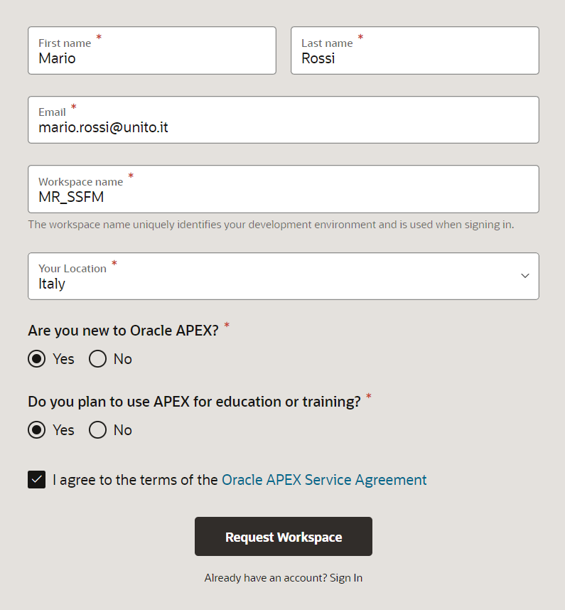
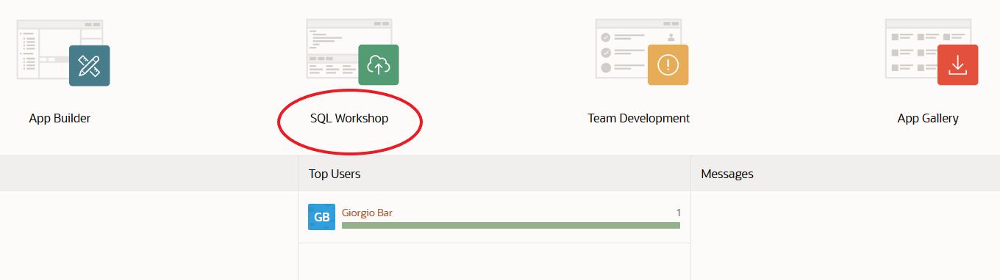
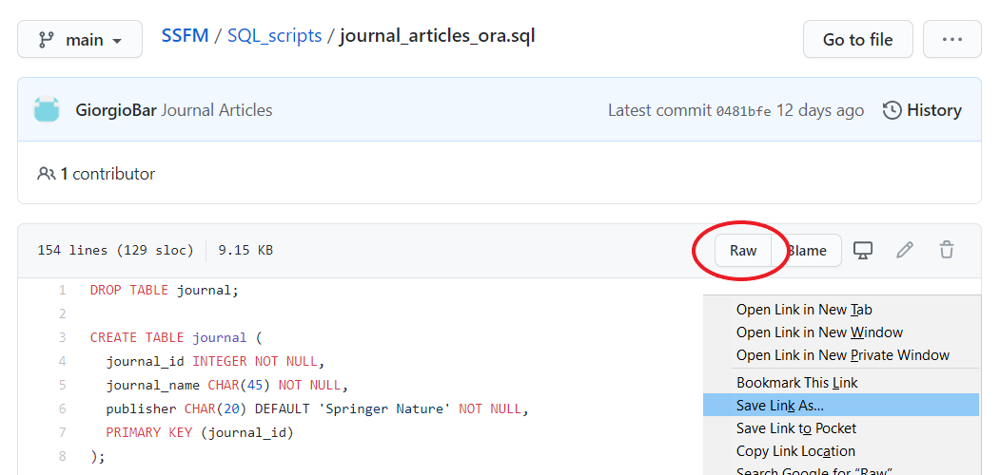
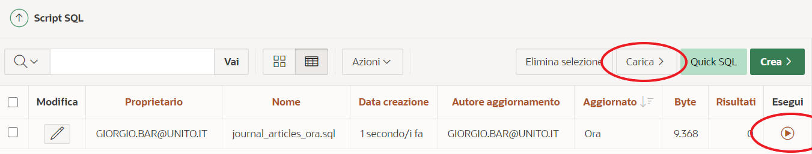
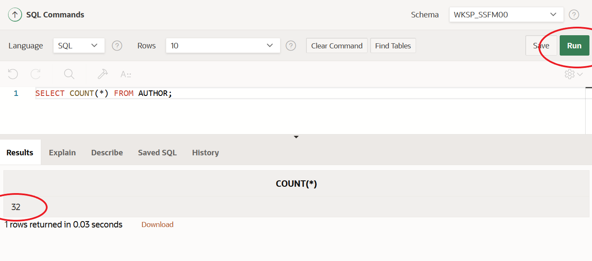

# Basi di dati relazionali e introduzione al Machine Learning

Scuola di Specializzazione in Fisica Medica - Anno accademico 2023/2024 (anno solare 2024/2025)

## Indice
1. [Richiesta di un ambiente Oracle](#Richiesta-di-un-ambiente-Oracle)
1. [Utilizzo di SQL Workshop](#Utilizzo-di-SQL-Workshop)
1. [Google Colaboratory](#Google-Colaboratory)

## Richiesta di un ambiente Oracle
Creare la propria area di lavoro (Workspace) su Oracle Application Express (APEX), 
aprendo il browser alla pagina <a href="https://apex.oracle.com/it/learn/getting-started/" target="_blank">`https://apex.oracle.com/it/learn/getting-started/`</a> e selezionando 
"Area di lavoro APEX gratuita", "Registrazione gratuita".

<!--  -->

Confermare la creazione del Workspace e impostare una password, seguendo le istruzioni 
fornite dalla email ricevuta.

## Utilizzo di SQL Workshop

Accedere alla propria area di lavoro, aprendo il browser alla pagina 
<a href="https://apex.oracle.com" target="_blank">`https://apex.oracle.com`</a>
ed eseguendo il login, quindi selezionare `SQL Workshop`.

<!--  -->

Per creare i database utilizzati nelle esercitazioni, scaricare da questo repository GitHub i file `slides_2025.sql` e `journal_articles_2025.sql` presenti nella cartella `SQL_scripts` (clic con il pulsante destro del mouse sul pulsante `Raw`).

Poi, dalla propria area di lavoro (`SQL Workshop`), selezionare `SQL Script`. 
Caricare ed eseguire gli script (ignorare le segnalazioni di errore "table or view does not exist").

Per eseguire una istruzione SQL, dalla propria area di lavoro (SQL Workshop) selezionare `SQL Commands`, immettere l'istruzione SQL nell'editor di comandi e fare clic su Esegui. 

I risultati del comando vengono mostrati nella parte inferiore della schermata. 
Possono essere eseguiti sia i comandi del linguaggio DML (Database Manipulation Language) che i comandi del linguaggio DDL (Database Definition Language).

<!--  -->

## Google Colaboratory

Per le esercitazioni di Machine Learning useremo , una piattaforma gratuita che permette di scrivere ed eseguire codice Python attraverso un browser, l'unico requisito per il suo utilizzo è un account Google.

<!--
Scaricare da questo repository GitHub il file `DecisionTreeClassifier.ipynb` presente nella cartella 
`Notebooks` (clic con il pulsante destro del mouse sul pulsante `Raw`) e salvarlo in una cartella locale.
Eseguire il login su Google Colaboratory e caricare il file.
-->