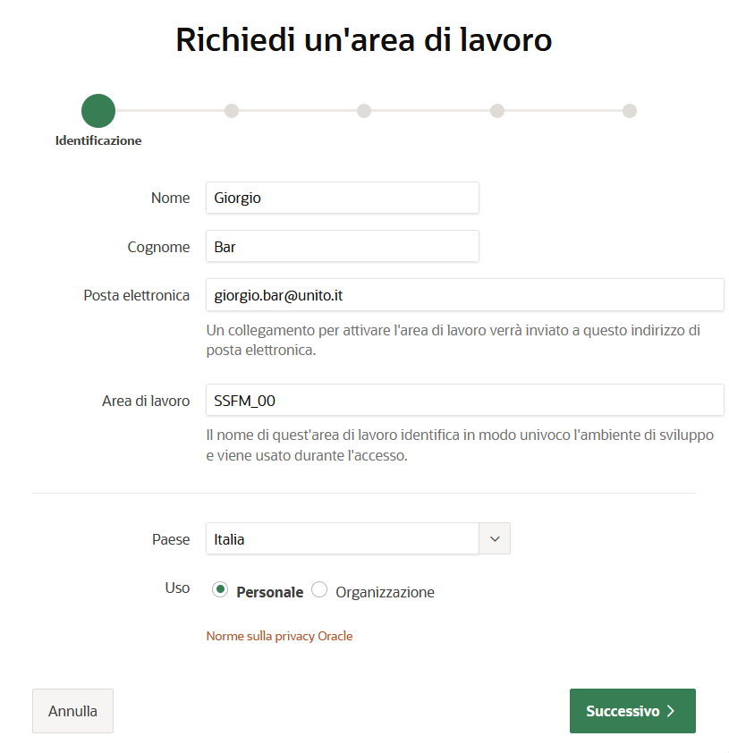
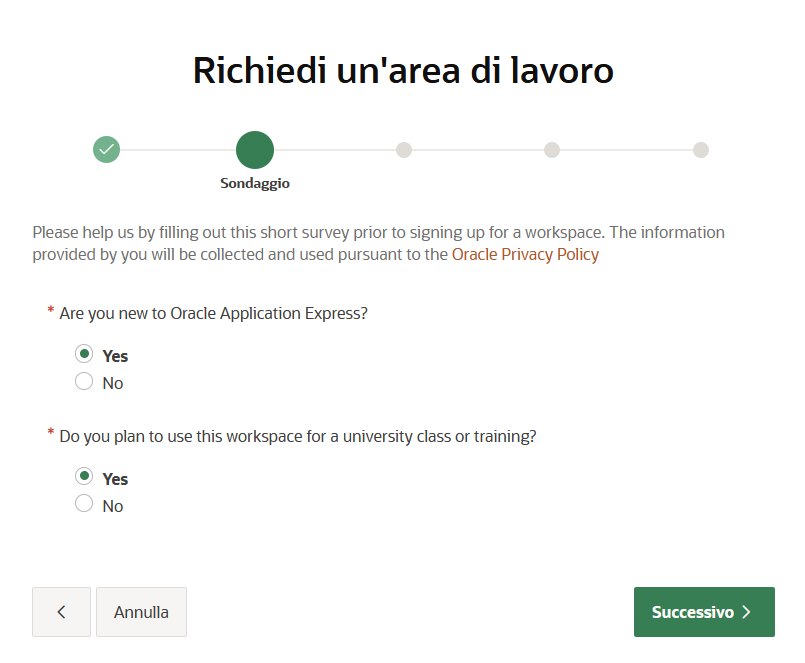
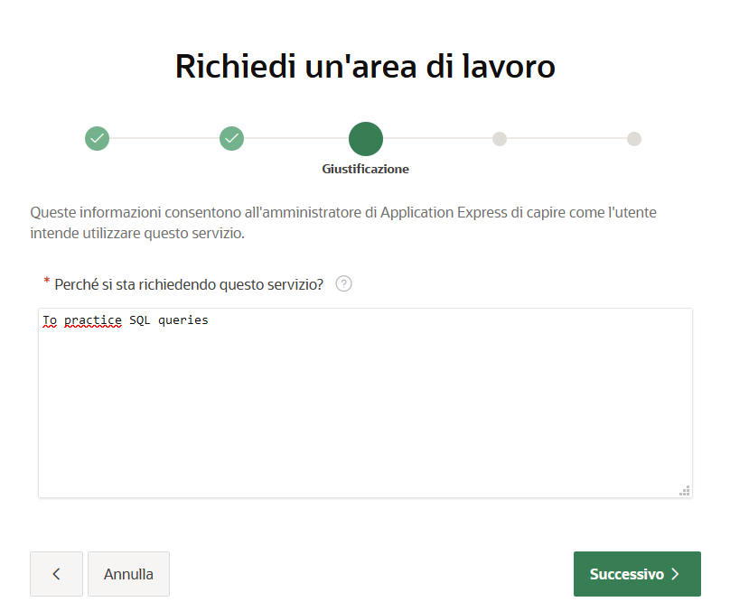
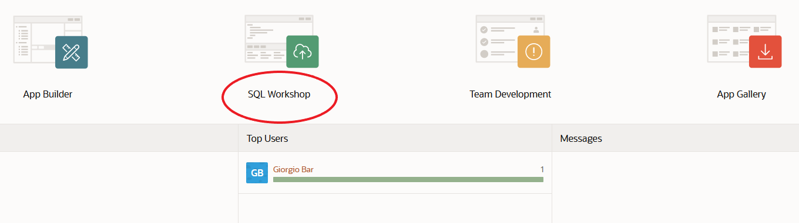
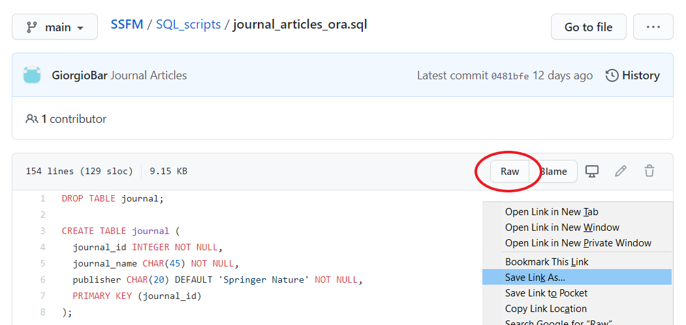
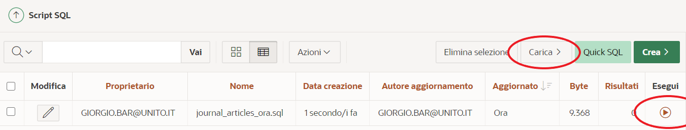
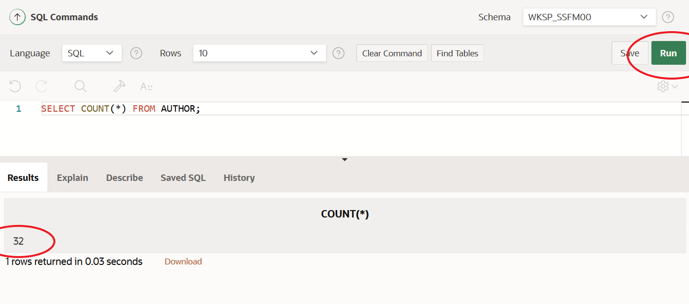

# Basi di dati relazionali e introduzione al Data Mining

Scuola di Specializzazione in Fisica Medica - Anno accademico 2021/2022

## Indice
1. [Richiesta di un ambiente Oracle](#Richiesta-di-un-ambiente-Oracle)
1. [Utilizzo di SQL Workshop](#Utilizzo-di-SQL-Workshop)
1. [Google Colaboratory](#Google-Colaboratory)
1. [Programma delle esercitazioni](#Programma-delle-esercitazioni)

## Richiesta di un ambiente Oracle
Creare la propria area di lavoro (Workspace) su Oracle Application Express (APEX), 
aprendo il browser alla pagina <a href="https://apex.oracle.com/it/learn/getting-started/" target="_blank">`https://apex.oracle.com/it/learn/getting-started/`</a> e selezionando 
"Richiedi un'area di lavoro gratuita".

Viene mostrato un wizard per la richiesta dell'area di lavoro, con una serie di passi:

<!--  -->

<!--  -->

<!--  -->

Confermare la creazione del Workspace e impostare una password, seguendo le istruzioni 
fornite dalla email ricevuta.

## Utilizzo di SQL Workshop

Accedere alla propria area di lavoro, aprendo il browser alla pagina 
<a href="https://apex.oracle.com" target="_blank">`https://apex.oracle.com`</a>
ed eseguendo il login, quindi selezionare `SQL Workshop`.

<!--  -->

Per creare il database utilizzato nelle esercitazioni, scaricare da questo repository GitHub
il file `journal_articles_ora.sql` presente nella cartella `SQL_scripts` (clic con il pulsante destro del mouse sul pulsante `Raw`).
Poi, dalla propria area di lavoro (`SQL Workshop`), selezionare `Script SQL` e caricare il file.
Eseguire lo script `journal_articles_ora.sql` (ignorare le segnalazioni di errore "table or view does not exist").

Per eseguire una istruzione SQL, selezionare `SQL Commands`, immettere l'istruzione SQL
nell'editor di comandi e fare clic su Esegui. I risultati del comando vengono mostrati
nella parte inferiore della schermata. Possono essere eseguiti 
sia i comandi del linguaggio DML (Database Manipulation Language) che i comandi del 
linguaggio DDL (Database Definition Language).

<!--  -->

## Google Colaboratory

Per l'esercitazione di Data Mining useremo , una piattaforma gratuita che permette 
di scrivere ed eseguire codice Python attraverso un browser, l'unico requisito per il suo utilizzo è un account Google.

Scaricare da questo repository GitHub il file `DecisionTreeClassifier.ipynb` presente nella cartella 
`Data_Mining` (clic con il pulsante destro del mouse sul pulsante `Raw`) e salvarlo in una cartella locale.
Eseguire il login su Google Colaboratory e caricare il file.

## Programma delle esercitazioni

| Data     | Argomento      |    
|----------|----------------|
| 14/03/2023 16:00 - 18:00 | Introduzione al linguaggio SQL. Struttura dell'istruzione SELECT, clausole WHERE e ORDER BY. INNER e OUTER JOIN. |
| 22/03/2023 16:00 - 18:00 | Operatori aggregati, clausole GROUP BY e HAVING. Interrogazioni nidificate, operatori IN e EXISTS, correlazione tra interrogazioni. |
| 29/03/2023 09:00 - 11:00 | DDL (Data Definition Language), creazione e modifica delle tabelle. Integrità dei dati, vincoli di tabella e di integrità referenziale. Modifica dei dati. Introduzione al Data Mining. |
| 29/03/2023 11:00 - 13:00 | Da definire

